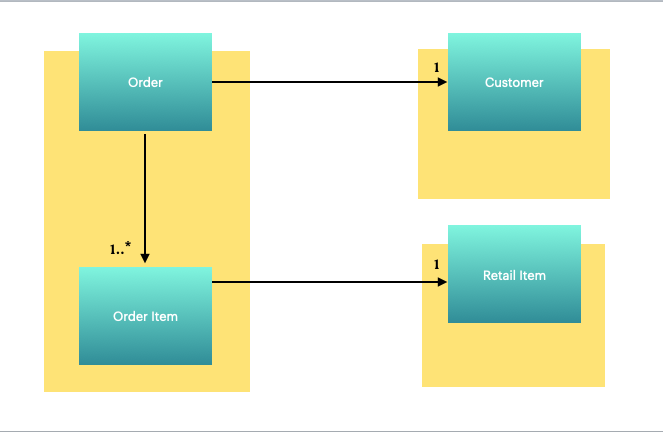

# Spring Data JDBC
This code repository is based on presentation given to Endurance Burlington team.

## About the demo
Spring Data JDBC provides rich functionality to work with Relational Database Management Systems (RDMS).  Check out documentation and samples at https://spring.io/projects/spring-data-jdbc.  The project was built using Spring Boot version 2.2.5.

## Instructions
* This project requires Open JDK version 11 or higher.
* Use gradle menu 'build' to build the application.

## Domain Model

